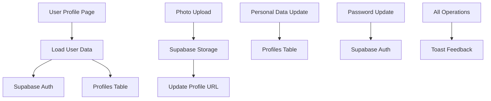

# Design Document

## Overview

Esta feature redesenha completamente a página de perfil existente (`src/pages/Perfil.tsx`) para criar uma interface moderna, responsiva e funcional que permite aos usuários gerenciar seus dados pessoais, foto de perfil e credenciais de autenticação. O design utiliza Tailwind CSS com uma paleta de cores baseada em Zinc 900 e Amber 500, mantendo consistência com o design system existente do projeto.

## Architecture

### Component Structure

```
src/pages/Perfil.tsx (redesigned)
├── ProfileHeader (seção de cabeçalho)
├── ProfilePhotoSection (upload e visualização de foto)
├── PersonalDataSection (nome e email)
├── PasswordSection (alteração de senha)
└── ToastNotifications (feedback visual)
```

### Data Flow



### State Management

- **Local State**: Gerenciado via React hooks (useState, useEffect)
- **Form State**: Estados separados para cada seção (dados pessoais, senha, foto)
- **Loading States**: Estados individuais para cada operação assíncrona
- **Error Handling**: Estados de erro específicos para cada operação

## Components and Interfaces

### Main Component Interface

```typescript
interface ProfileData {
  nome: string;
  foto_url?: string;
}

interface PasswordData {
  newPassword: string;
  confirmPassword: string;
}

interface ProfilePageState {
  profile: ProfileData;
  loading: boolean;
  saving: boolean;
  uploadingPhoto: boolean;
  updatingPassword: boolean;
  photoPreview?: string;
}
```

### ProfilePhotoSection Component

```typescript
interface ProfilePhotoSectionProps {
  currentPhotoUrl?: string;
  onPhotoUpload: (file: File) => Promise<void>;
  uploading: boolean;
}
```

**Features:**
- Circular avatar display (128px diameter)
- Drag & drop file upload
- File type validation (.jpg, .jpeg, .png, .webp)
- Preview before upload
- Placeholder with user icon when no photo
- Upload progress indicator

### PersonalDataSection Component

```typescript
interface PersonalDataSectionProps {
  profile: ProfileData;
  userEmail: string;
  onProfileUpdate: (data: ProfileData) => Promise<void>;
  saving: boolean;
}
```

**Features:**
- Nome field (required, text input)
- Email field (disabled, display only)
- Form validation
- Save button with loading state

### PasswordSection Component

```typescript
interface PasswordSectionProps {
  onPasswordUpdate: (password: string) => Promise<void>;
  updating: boolean;
}
```

**Features:**
- New password input with show/hide toggle
- Password confirmation field
- Minimum 6 characters validation
- Separate save button
- Password strength indicator (optional)

## Data Models

### Profile Model (Supabase Table)

```sql
-- Existing table structure (no changes needed)
profiles {
  user_id: UUID (PK, FK to auth.users.id)
  nome: VARCHAR (NOT NULL)
  foto_url: VARCHAR (nullable)
  peso_atual: NUMERIC (nullable) -- Will be ignored in new design
  created_at: TIMESTAMP WITH TIME ZONE
  updated_at: TIMESTAMP WITH TIME ZONE
}
```

### Storage Structure

```
avatars/
├── {user_id}/
│   └── avatar.{ext} (jpg, jpeg, png, webp)
```

**File Naming Convention:**
- Format: `{user_id}/avatar.{extension}`
- Max size: 5MB
- Allowed types: image/jpeg, image/png, image/webp

## Error Handling

### Validation Errors

```typescript
interface ValidationErrors {
  nome?: string;
  email?: string;
  password?: string;
  photo?: string;
}
```

**Validation Rules:**
- Nome: Required, min 2 characters, max 100 characters
- Email: Valid email format (handled by Supabase Auth)
- Password: Min 6 characters, max 128 characters
- Photo: Max 5MB, allowed extensions only

### Error States

1. **Network Errors**: Connection issues with Supabase
2. **Authentication Errors**: Invalid credentials or expired session
3. **Storage Errors**: Upload failures or storage quota exceeded
4. **Validation Errors**: Client-side form validation failures
5. **Permission Errors**: RLS policy violations

### Error Display Strategy

- **Toast Notifications**: For operation results (success/error)
- **Inline Validation**: Real-time field validation
- **Error Boundaries**: Catch unexpected component errors
- **Retry Mechanisms**: For transient network errors

## Testing Strategy

### Unit Tests

```typescript
// Test files to create:
// src/pages/__tests__/Perfil.test.tsx
// src/components/__tests__/ProfilePhotoSection.test.tsx
// src/components/__tests__/PersonalDataSection.test.tsx
// src/components/__tests__/PasswordSection.test.tsx
```

**Test Coverage:**
- Component rendering with different states
- Form validation logic
- File upload validation
- Error handling scenarios
- Loading states
- User interactions (clicks, form submissions)

### Integration Tests

- Supabase client integration
- File upload to storage
- Profile data updates
- Authentication state changes
- Toast notification triggers

### E2E Tests (Optional)

- Complete user flow: login → profile update → logout
- Photo upload workflow
- Password change workflow
- Error scenarios (network failures, invalid data)

## Design System Integration

### Color Palette

```css
/* Primary Colors */
--zinc-900: #18181b;     /* Background, text */
--amber-500: #f59e0b;    /* Accent, highlights */

/* Supporting Colors */
--zinc-800: #27272a;     /* Card backgrounds */
--zinc-700: #3f3f46;     /* Borders, dividers */
--zinc-600: #52525b;     /* Muted text */
--zinc-100: #f4f4f5;     /* Light text on dark */

/* Status Colors */
--green-500: #10b981;    /* Success */
--red-500: #ef4444;      /* Error */
--blue-500: #3b82f6;     /* Info */
```

### Typography Scale

```css
/* Headings */
.text-3xl { font-size: 1.875rem; }  /* Page title */
.text-xl { font-size: 1.25rem; }    /* Section titles */
.text-lg { font-size: 1.125rem; }   /* Subsection titles */

/* Body Text */
.text-base { font-size: 1rem; }     /* Regular text */
.text-sm { font-size: 0.875rem; }   /* Helper text */
.text-xs { font-size: 0.75rem; }    /* Captions */
```

### Component Styling

```css
/* Cards */
.profile-card {
  @apply bg-zinc-800 rounded-2xl shadow-lg border border-zinc-700;
}

/* Buttons */
.btn-primary {
  @apply bg-amber-500 hover:bg-amber-600 text-zinc-900 font-medium;
}

.btn-secondary {
  @apply bg-zinc-700 hover:bg-zinc-600 text-zinc-100 border border-zinc-600;
}

/* Form Elements */
.form-input {
  @apply bg-zinc-800 border-zinc-600 text-zinc-100 focus:border-amber-500;
}
```

### Responsive Breakpoints

```css
/* Mobile First Approach */
.container {
  @apply px-4 mx-auto;
}

/* Tablet: 768px+ */
@media (min-width: 768px) {
  .container { @apply px-6 max-w-2xl; }
  .form-grid { @apply grid-cols-2; }
}

/* Desktop: 1024px+ */
@media (min-width: 1024px) {
  .container { @apply px-8 max-w-4xl; }
}
```

## Security Considerations

### Row Level Security (RLS)

- Profiles table: Users can only access their own profile
- Storage bucket: Users can only upload/modify their own avatar
- Authentication: All operations require valid session

### Data Validation

- Server-side validation via Supabase RLS policies
- Client-side validation for UX
- File type and size validation for uploads
- SQL injection prevention via parameterized queries

### Privacy

- Email changes require email verification
- Password changes invalidate other sessions
- Photo URLs are public but file names are non-guessable
- No sensitive data in client-side state

## Performance Optimizations

### Image Handling

- Automatic image compression before upload
- WebP format preference for better compression
- Lazy loading for avatar images
- CDN delivery via Supabase Storage

### Data Loading

- Minimal data fetching (only required fields)
- Optimistic updates for better UX
- Debounced form validation
- Cached user session data

### Bundle Size

- Tree-shaking unused Tailwind classes
- Lazy loading of heavy components
- Minimal external dependencies
- Code splitting for profile page

## Accessibility

### WCAG 2.1 AA Compliance

- Proper heading hierarchy (h1 → h2 → h3)
- Sufficient color contrast ratios
- Keyboard navigation support
- Screen reader compatibility
- Focus management
- Alt text for images
- Form labels and descriptions
- Error announcements

### Implementation Details

```typescript
// Accessibility attributes
<input
  aria-label="Nome completo"
  aria-describedby="nome-help"
  aria-invalid={errors.nome ? 'true' : 'false'}
/>

<div id="nome-help" className="sr-only">
  Digite seu nome completo
</div>
```